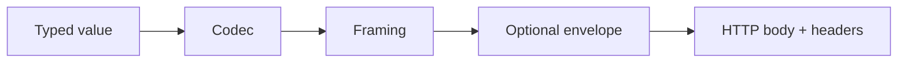

# CrateStack Transport Architecture

## Status

Proposed target architecture. This document is the canonical transport design reference to use before changing routing, client runtime, or generated contracts.

Current implementation has closed most of this document's original gap, though it started narrower:

1. generated Axum routers can negotiate multiple response codecs per router today via `CodecSet<Primary, Secondary>` (an `HttpTransport` impl covering exactly two codec slots) — a router is only single-codec if its owner passes a single `CratestackCodec` (e.g. `CborCodec` alone) instead of a `CodecSet`. See `./http-transport-contract.md`'s "Current Repo Mapping" for a real example (`catalog-service` wiring `CodecSet::new(CborCodec, JsonCodec)`).
2. `cratestack-codec-cbor` and `cratestack-codec-json` are both dedicated, checked-in first-party codec crates today — JSON is no longer inline-only in `cratestack-client-rust`.
3. COSE remains an unimplemented envelope seam.
4. `application/cbor-seq` is implemented on both bindings for the shapes each has opted into: RPC's `Sequence`-kind ops negotiate it directly, and REST procedures explicitly marked `@stream` genuinely stream (flush-per-item, not buffered) rather than being buffered through a single-value response helper. It is not implemented for CRUD/model routes on either binding, and not implemented for request bodies on either binding.

## RPC binding update

Since this document was first written, CrateStack also ships a **second binding style** for `.cstack` schemas — see `./../internals/rpc-transport-adr.md` for the canonical ADR. The codec / framing / envelope layering below is unchanged and applies to both bindings; the addition is at the *routing* layer:

1. A `.cstack` schema picks **one** generation style with the top-level `transport rest|rpc|grpc` directive. Default is `rest` (back-compat with everything written before the directive existed).
2. `transport rpc` schemas mount `POST /rpc/{op_id}` (unary) and `POST /rpc/batch` instead of REST-shaped per-model routes. Streaming for `Sequence`-kind ops works on the same unary route via `Accept: application/cbor-seq` — same negotiated framing as below.
3. Errors on the RPC binding go on the wire as `RpcErrorBody { code, message, details? }` with gRPC-style lowercase codes (`not_found`, `invalid_argument`, `permission_denied`, …) rather than the REST `CratestackErrorResponse` shape.
4. `transport grpc` schemas pick a third generation style: `cratestack-proto` emits `.proto` message and enum definitions for the schema's types, backed by a field-number lockfile (`<schema>.pb.lock`) so wire numbers stay stable across schema edits, and `cratestack-grpc` mounts a hand-rolled `tonic` service (macro-generated protobuf mirror structs, mountable into an `axum::Router` via `cratestack_schema::grpc::into_router`) covering model CRUD **and procedures** (unary + list-arity server-streaming, shipped in v0.7.2 via #208). What's still missing is on the **client** side: none of the three generated gRPC clients (Rust, Dart, TypeScript) expose procedure methods yet — tracked as issue #171. See "gRPC binding" below for the full picture.
5. `@@subscribe` model-event subscriptions shipped in v0.7.2 (#183, #390) over **Server-Sent Events**, not WebSocket — see "Subscriptions: shipped over SSE, not WebSocket" below. A true bidirectional WebSocket binding remains pending, gated on a concrete use case that needs client-to-server frames on the same channel.

## gRPC binding

`transport grpc` is a third, already-shipped peer to `transport rest` and `transport rpc` — not an HTTP-JSON/CBOR binding but a protobuf-over-`tonic` one. It shipped in v0.4.14 ("Protobuf + gRPC support"), with a native Dart gRPC client generator following in v0.4.17.

What it generates:

1. **`.proto` definitions** — `cratestack-proto` owns the field-number lockfile and stable-numbering algorithm; it emits `.proto` message and enum definitions for the schema's types and does not itself contain a gRPC runtime.
2. **Server-side gRPC service** — `cratestack-grpc` is the server-integration runtime, the gRPC sibling of `cratestack-axum`. It holds `CratestackError` → `tonic::Status` mapping, `tonic::metadata::MetadataMap` ↔ `http::HeaderMap` conversion so the existing header-driven `AuthProvider` ports unchanged, and unframed-body envelope canonicalization for request signing. Behind a Cargo `grpc` feature, it macro-generates protobuf mirror structs plus a hand-rolled `tonic` service covering model CRUD and procedures, mountable into an `axum::Router`: unary procedures get a `tonic::server::UnaryService` impl and list-arity procedures get a `ServerStreamingService` impl, both dispatched through the same handler function — and therefore the same policy/audit pipeline — that REST and RPC already call (shipped in v0.7.2, #208).
3. **Native Rust gRPC client** — `cratestack-client-rust`'s `grpc` Cargo feature (off by default; it pulls in `tonic`, `prost`, `h2`, `tower`) generates `cratestack_schema::grpc::Client<T = tonic::transport::Channel>` on top of `CratestackGrpcClient<T>`, mirroring `tonic-build`'s own generated client shape. Errors surface as `GrpcClientError`, wrapping `tonic::Status` directly. Model CRUD only today: the generated client has no methods for `procedure` declarations even though the server now serves them behind the `UnaryService`/`ServerStreamingService` impls above — that client-side gap is what issue #171 tracks. See `./client-runtime.md` for the client-side crate split.
4. **Dart gRPC client** — `generate-dart` gained a native gRPC client generator for `transport grpc` schemas in v0.4.17, with channel-shutdown and per-call option exposure on the generated client. Same scope limit as the Rust client: CRUD-only, no generated methods for `procedure` declarations (#171).

## Purpose

CrateStack needs a transport model that stays correct as the project grows from today's CBOR-first bootstrap slice to a broader multi-client, multi-service, and optional signed-envelope platform.

This document fixes the architecture vocabulary first so implementation work does not blur distinct concerns.

## Core Model

CrateStack transport is composed from three separate layers:

1. codec
2. framing
3. envelope

These layers must remain separate in docs, runtime code, generated routes, and client configuration.

## Definitions

### Codec

A codec converts a typed value graph into bytes and back.

Examples:

1. JSON
2. CBOR

Codec responsibilities:

1. value serialization and deserialization
2. codec-specific content rules
3. typed error reporting for encode and decode failures

Codec non-responsibilities:

1. request authentication
2. response negotiation policy
3. body streaming semantics
4. signing or encryption

### Framing

Framing defines how one or more encoded values are arranged inside a single HTTP body.

Examples:

1. single value
2. sequence

Framing responsibilities:

1. define whether a body contains one payload or many
2. define how multiple payloads are delimited or concatenated
3. constrain which endpoints can legally use the framing mode

Framing non-responsibilities:

1. typed value serialization rules
2. cryptographic protection

### Envelope

An envelope wraps already-encoded and already-framed bytes.

Examples:

1. none
2. COSE Sign1 in a future implementation

Envelope responsibilities:

1. sealing and opening transport bytes
2. binding transport bytes to signatures or future cryptographic metadata
3. optionally using auth context or host-provided signing material

Envelope non-responsibilities:

1. primary typed serialization format
2. list versus sequence semantics

## Design Rules

### Rule 1: COSE is an envelope, not a codec

COSE must not be modeled as a peer alternative to CBOR or JSON.

Correct model:

1. choose codec
2. choose framing
3. optionally apply COSE

Incorrect model:

1. choose one of JSON, CBOR, COSE

This distinction matters because COSE protects bytes that were already produced by an inner transport representation.

### Rule 2: `application/cbor-seq` is not just another codec label

`application/cbor` and `application/cbor-seq` share a CBOR value model, but they do not have the same body semantics.

1. `application/cbor` means one CBOR data item per body
2. `application/cbor-seq` means multiple top-level CBOR data items in sequence

That means `cbor-seq` belongs at the framing layer, even if media-type handling ends up representing it as a distinct transport option in code.

### Rule 3: Transport capability is route-specific

Not every generated route should support every transport shape.

Examples:

1. `GET /products/{id}` is naturally a single-value response
2. `POST /products` is naturally a single-value request and response
3. an export, feed, or watch procedure may support sequence responses

The runtime must allow route capabilities to be narrower than the full registry of installed codecs and framings.

### Rule 4: Request and response negotiation are related but separate

For HTTP:

1. request decoding is driven by `Content-Type`
2. response encoding is driven by `Accept`

The server must not assume that the request body codec and the response body codec are always the same, even if many clients choose to align them.

### Rule 5: Error bodies follow the negotiated response transport

Once the server has successfully selected a response transport, both success and error bodies should use it.

Before response transport selection is possible, the server may fall back to a plain text or minimal host-defined error response only for truly pre-negotiation failures.

## Media-Type Direction

### Implemented today

1. `application/cbor` on every generated server route (the default codec parameter for a generated `Client<C = CborCodec>` and the codec every router accepts at minimum)
2. `application/json` as well, on any router built with `JsonCodec` alone or with a `CodecSet` that includes it (e.g. `CodecSet::new(CborCodec, JsonCodec)`)

### Framing-aware media types

1. `application/cbor-seq` — implemented for RPC `Sequence`-kind ops and for REST procedures marked `@stream`; not implemented for CRUD/model routes or for request bodies on either binding

### Planned future envelope-aware media types

This repo has not yet committed to final envelope media types for COSE-wrapped payloads. That decision must happen explicitly rather than being implied by implementation.

Questions to settle before COSE implementation:

1. whether the outer response type is a generic COSE media type or a CrateStack-specific profile
2. how the inner codec and framing are declared or discoverable
3. whether some routes require envelopes while others merely allow them

## Recommended Runtime Shape

The current `CratestackCodec` and `CratestackEnvelope` split is still directionally correct, but it is not sufficient on its own for content negotiation and sequence framing.

The long-term runtime should represent three concepts:

1. codec registry
2. framing policy
3. envelope policy

One acceptable shape is:

1. keep `CratestackCodec` for typed encoding
2. add a framing abstraction for single versus sequence bodies
3. keep `CratestackEnvelope` for post-framing wrapping
4. add a transport selector or registry that resolves request and response behavior from HTTP headers plus route capability metadata

The implementation does not need to adopt those exact trait names, but the architectural split must remain visible.

## Route Capability Model

Generated routes should eventually declare transport capabilities instead of inheriting one implicit codec for every path.

A route capability model should answer:

1. which request media types are accepted
2. which response media types are supported
3. whether sequence responses are allowed
4. whether an envelope is optional, forbidden, or required

Illustrative capability matrix:

| Route shape | Request transport | Response transport |
| --- | --- | --- |
| `GET /products/{id}` | none | JSON, CBOR |
| `POST /products` | JSON, CBOR | JSON, CBOR |
| `GET /products` | none | JSON, CBOR, maybe CBOR sequence |
| `POST /$procs/exportProducts` | JSON, CBOR | CBOR sequence |

This table is directional guidance, not a hard commitment that list routes must always support sequence framing.

## `cbor-seq` Guidance

`application/cbor-seq` should be introduced as a selective transport mode rather than a blanket replacement for list responses.

Good early fits:

1. export procedures
2. event feeds
3. watch or tail style responses
4. large result streams where incremental processing matters

Poor early fits:

1. standard CRUD create or update requests
2. simple detail fetches
3. small procedure responses that already fit the single-value model cleanly

Recommended rollout:

1. implement negotiated JSON and CBOR single-value transport first
2. add route capability metadata
3. add response-side `cbor-seq` for explicitly sequence-oriented endpoints
4. consider request-side `cbor-seq` only after a concrete use case exists

## Client Architecture Direction

Clients should mirror the same transport split.

Client responsibilities:

1. choose a request transport explicitly when a request body exists
2. advertise one or more acceptable response transports
3. decode responses based on actual response `Content-Type`
4. expose explicit sequence APIs instead of forcing sequence responses through single-value decode helpers

Recommended client defaults:

1. default request transport: CBOR for internal first-party clients
2. default accepted response transports: CBOR first, JSON second
3. optional route- or request-level override when interoperability needs differ

This has shipped: `cratestack-client-rust` offers a buffered list helper for ordinary reads plus explicit incremental client APIs (`RpcClient::call_streaming`, `CratestackClient::post_list_streamed`) for sequence responses, rather than forcing every sequence through the buffered path. See `./client-runtime.md`'s "Streaming surfaces" section for the full set, including the Flutter/dio equivalents.

## Current Repo Mapping

This section previously described a state that has since been overtaken by real negotiation work — see the "Status" section at the top of this document for the current, corrected picture. What's still genuinely ahead of the checked-in implementation:

1. generated Axum routes validate `Accept` and `Content-Type` against whichever codec(s) the router was actually built with — a single `CratestackCodec` for a single-codec router, or both slots of a `CodecSet<Primary, Secondary>` for a negotiated one; `cratestack-codec-cbor` and `cratestack-codec-json` are both real, dedicated checked-in codec crates today
2. `cratestack-client-rust` and `cratestack-client-flutter` expose runtime codec configuration for CBOR and JSON, and decode responses by actual `Content-Type` rather than assuming the configured codec — but each client instance still sends requests through one *primary* configured codec, so multi-codec request negotiation from a single client instance is not a thing
3. COSE envelope configuration exists as a reserved runtime option, but the runtime rejects it because implementation is missing

## Implementation Phasing

Recommended order:

1. document the transport model and HTTP contract first
2. add a dedicated JSON codec crate
3. add negotiated JSON and CBOR request and response handling for generated routes
4. update Rust client decoding to respect actual response `Content-Type`
5. expose response preference ordering in client runtime config
6. add route capability metadata for transport support
7. add selective `application/cbor-seq` support for sequence-oriented routes
8. add COSE envelope support only after codec and framing boundaries are proven in code

## Non-Goals For The First Transport Expansion

1. supporting every route under every media type from day one
2. implementing COSE and multi-codec negotiation in the same patch set
3. treating sequence framing as required for all list endpoints
4. hiding transport differences behind vague automatic magic that clients cannot reason about

## Canonical Companion Document

`./http-transport-contract.md` should be read alongside this document. This architecture file explains the model and boundaries. The HTTP contract file explains concrete request, response, and negotiation behavior.

## Subscriptions: shipped over SSE, not WebSocket

An earlier draft of this document proposed a WebSocket binding as the vehicle for model-event subscriptions (six-variant frame envelope, upgrade-time HMAC, `cratestack-rpc-v1+cbor` subprotocol). That WS design was superseded before implementation: v0.7.2 shipped subscriptions over **Server-Sent Events** instead (#183, #390), reusing the existing sequence-streaming machinery rather than building a new bidirectional transport. The WS proposal's cancellation objection — a WebSocket needs an explicit `Cancel` frame and upgrade-time auth because the channel is genuinely bidirectional — doesn't apply to SSE for this specific shape: a `@@subscribe` feed is fire-and-forget, no-replay, one subscription per connection, so plain header-based auth (the same convention every other HTTP RPC route uses) and an ordinary client disconnect are enough.

What actually shipped:

1. **`@@subscribe` schema directive.** A bare model attribute — `@@subscribe` takes no arguments (`@@subscribe(filter: "...")` is a parse error) — valid only under `transport rpc` and only alongside `@@emit(...)` on the same model. It lowers to `OpKind::Subscription`.
2. **`GET /rpc/subscribe/{op_id}` endpoint**, dispatched through the existing outbox-drain pipeline (`crates/cratestack-macros/src/transport/subscribe_dispatch.rs`). The client asks for it with `Accept: text/event-stream`; anything else is rejected before a `CratestackEventBus` subscription is even registered.
3. **`CratestackEventBus` fan-out**, already present in `cratestack-core`, is what the subscription rides on. Backpressure is a bounded per-subscription channel that closes on overflow, surfaced to the client as a terminal `event: error` SSE frame — there is no replay and no reconnection/resume semantics.
4. **Row-level `@@allow` policy is not replayed against streamed events.** That machinery lives in the SQL query builders and has no analogue for an in-memory outbox-sourced event — a documented scope limit for this first cut, not an oversight.

A true bidirectional **WebSocket binding** — needed for request frames flowing on the same channel as responses, rather than one-way server-to-client push — remains unimplemented and unscheduled. CrateStack's audit and event-bus consumers today are server-to-server and poll or consume from the audit sink directly, so nothing in the current consumer set needs it. **When a concrete bidirectional-streaming use case appears, that becomes the next implementation lift on this transport surface.**
