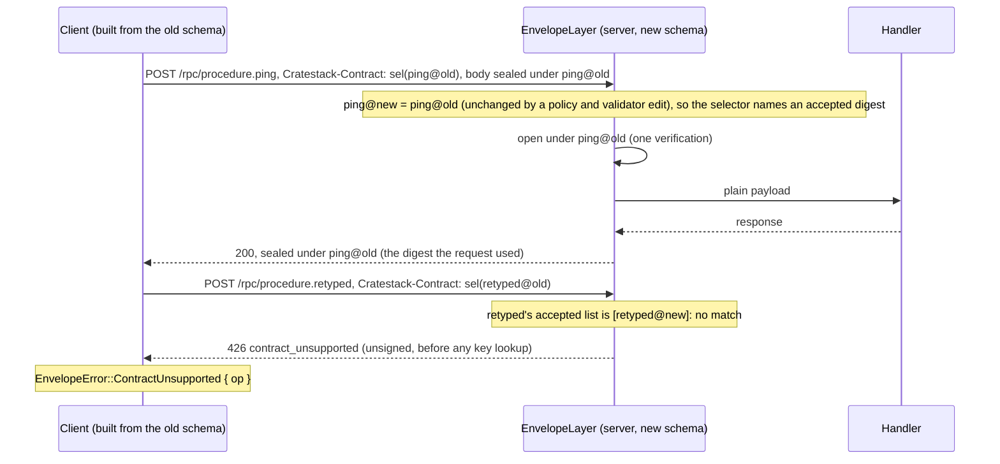
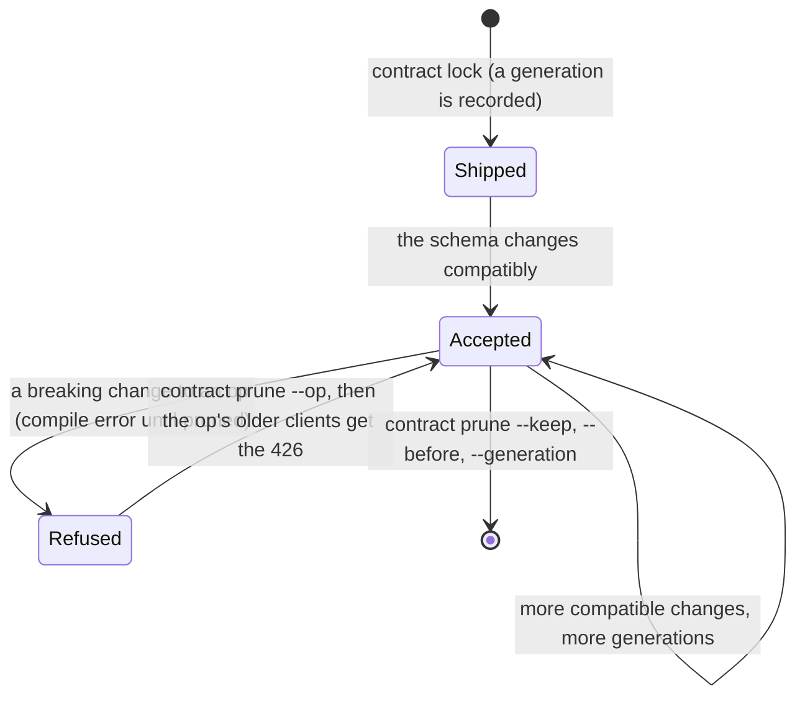

# Signed transport (COSE envelope layer)

<Warning>
**Since CrateStack 0.14.0** ([cratestack#1006](https://github.com/cratestack/cratestack/issues/1006));
it was first published as 0.13.1, which is yanked because it made breaking changes in a patch release.
The design is
[ADR 0006](/internals/cose-envelope-adr). The generated Rust client signs from the first
release after 0.14.2 ([cratestack#1007](https://github.com/cratestack/cratestack/issues/1007),
see [The Rust client](#the-rust-client)); binding v1, including the AAD, froze in 0.15.0
(cratestack#1082). **Binding version 2 (0.16.0, [cratestack#1123](https://github.com/cratestack/cratestack/issues/1123))
is a breaking wire change:** the AAD binds the digest of the op being called instead of the whole
schema's, so a server-only schema edit no longer refuses every signed client, and a version 2
server refuses version 1 messages. Upgrade servers and clients together, and see
[Evolving a schema under signed clients](#evolving-a-schema-under-signed-clients).
</Warning>

`EnvelopeLayer` is a tower layer for the generated REST and RPC routers. It opens
signed requests (COSE_Sign1 or COSE_Mac0 bodies), hands the router the plain CBOR payload
they wrap, and seals the router's response against the same request. A signature then
covers the payload **and** what the request was for: the service, the method, the route and
its parameters, the query, the op's wire contract, and the `Idempotency-Key` / `If-Match` headers.

This is ADR 0006's P0 scope: unary messages and `nonce` replay protection. Streams (`chain`
mode) are P1, so a signed request never gets a stream (see [Limits](#limits)).

Use it when a TLS terminator, a proxy or a message queue sits between the client and the
service and must not be able to alter or replay a request: payments, device commands,
service-to-service calls across a trust boundary. The layer is opt-in per op. The digest a
signed request binds is its **op's contract digest**: it moves only when that op's wire shape
does, so a policy, an index, SQL, a validator, another op or a new procedure leaves every older
client working (cratestack#1123, see
[Evolving a schema under signed clients](#evolving-a-schema-under-signed-clients)).

## Enable it

The server facades carry two features, both off by default:

| Feature | What it adds |
| --- | --- |
| `envelope` | `cratestack::envelope_layer` (the layer and its traits) and a generated `cratestack_schema::axum::envelope_layer(..)` per schema. No crypto crate: bring your own `ServerEnvelope`. |
| `cose` | `envelope`, plus the COSE envelope: `cratestack::cose` is a re-export of `cratestack-cose`, and `CoseEnvelope` is the default `ServerEnvelope`. |

```toml
cratestack = { package = "cratestack-pg", version = "0.14", features = ["cose"] }
# or `package = "cratestack-api"` for a `db = None` service
```

Without `cose` (with or without `envelope`), no `cratestack-cose`, `p256` or `ed25519-dalek`
is in the facade's graph. The generated `envelope_layer` follows the feature of the facade a
schema is compiled through, so one crate turning `envelope` on changes nothing for another
crate's schemas in the same build.

## Wire it

Build the COSE envelope, then the layer through the schema's generated
`envelope_layer(envelope, policy, audience)`. It picks the schema's transport (REST or RPC),
its route descriptors and its `ACCEPTED_CONTRACTS`, and returns the builder:

```rust
use std::sync::Arc;

use cratestack::cose::{CoseEnvelope, CoseMode, Ed25519Signer, StaticVerifierResolver};
use cratestack::envelope_layer::EnvelopeMode;
use cratestack::InMemoryNonceStore;

// The server's signing key, and the client keys it accepts.
let resolver = StaticVerifierResolver::new().with_key(client_verify_key);
let envelope = CoseEnvelope::server(
    CoseMode::Sign1,
    Arc::new(server_signer),          // an `Ed25519Signer`, or any `CoseSigner`
    Arc::new(resolver),               // any `CoseVerifierResolver`
    Arc::new(InMemoryNonceStore::new()),
)
.build()?;

let envelope_layer =
    cratestack_schema::axum::envelope_layer(envelope, EnvelopeMode::Required, "payments")
        .mount_prefix("/api") // the router is nested under /api
        .build()?;

let router = generated_router
    .layer(idempotency_layer)
    .layer(rate_limit_layer)
    .layer(envelope_layer); // last, so it runs first
let app = axum::Router::new().nest("/api", router);
```

- **`audience`** is this service's configured logical id, which every binding carries. It is
  not the `Host` header, must not be empty, and must differ from the audience this service
  seals its own outbound requests for.
- **The nonce store** is the replay cache. `InMemoryNonceStore` protects one process; behind
  several replicas use a shared one, such as `cratestack_cose::auth::AuthNonceStore::redis(url)`
  (the `auth` feature of a direct `cratestack-cose` dependency; see the crate README for the
  Redis requirements).
- **`.build()`** refuses an empty audience, a missing policy or transport, an empty REST
  route table, a zero body limit, an `allow_unresolved` template not starting with `/`, and
  an envelope whose media type is not `application/cose` or a type it claims.

The builder's calls commute: `.mount_prefix(..)` wins over the prefix the generated function
passes (the root), whichever order they come in. The other builder calls:

| Call | Default | Purpose |
| --- | --- | --- |
| `.mount_prefix("/api")` | `""` | Where the router is `nest`ed. Required for a nested router: without it nothing resolves, and every request fails closed (or, under a non-`Required` `unresolved_mode`, passes unsigned; see [Fail closed](#fail-closed)). |
| `.allow_unresolved(["/health"])` | none | Hand-written routes merged into the generated router before the layer. |
| `.unresolved_mode(mode)` | the policy's | Explicit opt-out of fail-closed for unbindable routes. |
| `.principal_mapper(..)` | `ThumbprintPrincipal` | What the signer is charged to. |
| `.response_seal_policy(..)` | `AcceptNamesEnvelope` | Under `Optional`, which unsigned responses are sealed. |
| `.max_body_bytes(n)` | `DEFAULT_MAX_BODY_BYTES` | The request body the layer buffers (`413` beyond). |
| `.max_contract_trials(n)` | `DEFAULT_MAX_CONTRACT_TRIALS` (4) | For a request that names no digest (no `Cratestack-Contract` header), how many of the op's accepted digests are tried, newest first. |

Without the generated function, `EnvelopeLayer::builder(envelope, audience,
cratestack_schema::ACCEPTED_CONTRACTS)` takes `.policy(..)` and one of `.rest(prefix,
cratestack_schema::axum::ROUTE_TRANSPORTS)`, `.rpc(prefix)` or `.binding_resolver(..)`;
neither the policy nor the transport has a default.

### Placement

The layer must be the **last** `.layer(..)` on the generated router, applied **before** the
router is `nest`ed or `merge`d:

- **Last, so it runs first.** The rate limiter and the idempotency layer key on the
  `VerifiedPrincipal` it inserts (`cose:<hex thumbprint>` by default), so a signed client needs
  neither `Authorization` nor `ConnectInfo`. The idempotency layer hashes the opened payload,
  so a client that re-seals a retry (a new `cti` under the same `Idempotency-Key`) gets the
  stored response, sealed afresh for the new request.
- **Through `Router::layer`**, so `MatchedPath` and the path parameters are in the request.
  A `ServiceBuilder` around the whole app loses them, and `nest_service` never sets
  `MatchedPath` for the outer mount.
- **An IP-level limiter outside it.** Verification, with its key-resolver and nonce-store
  lookups, runs **before** rate limiting, and under `Optional` so does signing every response
  to a signed or nonce-bound request. Bound what an unauthenticated flood can cost with a
  limiter in front of the envelope.

The generated routers' default body limit applies to the payload after opening. The layer's
own cap, `DEFAULT_MAX_BODY_BYTES`, is that limit plus 16 KiB of envelope overhead; raise it
with `.max_body_bytes(..)` if the router gets a larger limit.

### Keys that change at run time

*(Unreleased, [cratestack#1149](https://github.com/cratestack/cratestack/issues/1149); through 0.14.2 write your own `CoseVerifierResolver`.)*
`StaticVerifierResolver` is fixed when you build it. For devices or peers that enrol after the
server starts, use `cratestack_cose::RegistryVerifierResolver`: share it as an `Arc`, give the
envelope one clone as its `CoseVerifierResolver`, and keep one for `register` and `revoke`.

```rust
use std::sync::Arc;
use cratestack::cose::{CoseEnvelope, CoseMode, CoseVerifierResolver, RegistryVerifierResolver};

// Bound the registry if callers can trigger registrations.
let registry = Arc::new(RegistryVerifierResolver::with_max_keys(10_000));

let envelope = CoseEnvelope::server(
    CoseMode::Sign1,
    Arc::new(server_signer),
    registry.clone() as Arc<dyn CoseVerifierResolver>,
    Arc::new(InMemoryNonceStore::new()),
)
.build()?;

// At enrolment: returns the kid (first 8 bytes of the key's RFC 9679 thumbprint).
let kid = registry.register(device_verify_key.clone())?;

// On sign-out: remove exactly this key...
registry.revoke_key(&device_verify_key);
// ...or everything filed under the kid (see the collision note below).
registry.revoke(&kid);
```

- **Key types.** Ed25519, ESP256, and both HMAC algorithms (256/64 and 256/256).
- **`with_max_keys(n)`** is a hard bound. A new key past it fails with `Conflict`; registering a key
  that is already present succeeds even when the registry is full. `new()` is unbounded.
- **Concurrency.** Each call takes one short `std` `RwLock`, never held across an `.await`. A
  `register` or `revoke` is atomic with respect to `resolve`, and a `register` that returned is
  visible to every later `resolve`. A request whose `resolve` already returned the key still
  finishes verifying with it, so a revocation applies to requests that resolve after it returns,
  not to ones already in flight.
- **Per process.** The state lives in memory. Every replica needs the same registrations (and a
  shared nonce store, see above), and a restart starts empty: re-register from your own store.
- **Collisions.** The `kid` is only 8 bytes. `revoke(kid)` removes every key under it: both
  algorithms of one HMAC secret, and any unrelated key whose `kid` happens to collide. To cut off
  one device, use `revoke_key(&key)`.
- **Unknown and revoked look the same.** An unknown `kid` resolves to no keys (not an error), so a
  revoked key and a never-registered one both get the coarse, unsigned `401`.
- `len()` and `is_empty()` report how many keys are held.

## Modes

An `EnvelopePolicy` picks a mode per op. `EnvelopeMode` is itself a policy (one mode for every
op), and so is any `Fn(&PolicyRequest<'_>) -> EnvelopeMode`. There is no default.

| Mode | Unsigned request | Signed request |
| --- | --- | --- |
| `Required` | Refused, unsigned `401`. | Opened; response always sealed. |
| `Optional` | Runs. Response sealed only with a valid `Cratestack-Nonce` **and** (the default `ResponseSealPolicy`) an `Accept` naming `application/cose`; otherwise plain. | Opened; response always sealed. |
| `Off` | Untouched. | Refused, unsigned `415`. |

- **Everything is signed under `Required`**, `GET`, `HEAD` and `DELETE` included: a bodiless
  request seals an empty payload and reaches the router bodiless. A signed `HEAD` still sends
  its COSE message as a request body, to which RFC 9110 gives no semantics: hyper and `reqwest`
  pass it over HTTP/1.1, but an intermediary may drop it (the request then fails, `401`) or
  refuse the request. Prefer `GET` under `Required`.
- **A signed request is always answered sealed**, under `Optional` as under `Required`, with
  its `Accept` forced to `application/cbor`. A verification failure is the `401`, never a
  downgrade to unsigned.
- **An unsigned seal under `Optional` binds the nonce and the payload, not the caller.** It
  proves this server answered this nonce and body, not who asked; do not read it as an
  authenticated exchange.
- **In every mode, a body whose `Content-Type` is `application/cose`** (any case, any
  parameters) is opened and verified, or refused with the `415`. It is never forwarded.
- **A bodiless `OPTIONS`** (a CORS preflight) passes untouched on both transports.

### Per-op policy

A policy sees a `PolicyRequest`: the method, the op (a REST route template such as
`/widgets/{id}`, or an RPC op id such as `procedure.ping`), and two flags. It sees no header,
so no request can talk it into a weaker mode.

```rust
use cratestack::envelope_layer::{EnvelopeMode, PolicyRequest};

let policy = |request: &PolicyRequest<'_>| {
    if request.is_subscription() { EnvelopeMode::Optional } else { EnvelopeMode::Required }
};
```

Annotate the closure's parameter type as above: the builder takes `impl EnvelopePolicy`,
not an `Fn` bound, so the compiler has nothing to infer it from. The same holds for
closure principal mappers and seal policies.

- An RPC subscription is shown with its **bare** op id (`model.Widget.subscribe`) and
  `is_subscription()` set.
- **`/rpc/batch`** runs under the **strictest** mode of `batch` itself and of every frame's
  op (`is_batch_frame()` set, method `POST`), so a batch cannot carry an op its policy would
  refuse unsigned. The frames are read by the body's base `Content-Type` (parameters and case
  ignored).
- `EnvelopePolicy::unresolved_mode()` decides traffic the layer cannot attribute to one op (next
  section). It defaults to `Required`; an `EnvelopeMode` used as the policy answers itself.

## Fail closed

Under a `Required` `unresolved_mode`, a route the router **matched** but the layer cannot bind
is refused with an unsigned `500` instead of passing unsigned. That is what a wrong or
missing mount prefix, `nest_service`, or route-descriptor drift looks like. The response body
is a generic internal error; the server log says `envelope misconfigured` (target
`cratestack`, throttled to once a minute) and names the matched route and the configured
prefix.

- **Hand-written routes** on the same router (`/health`, a `.well-known` path) are listed with
  `.allow_unresolved(["/health"])`, relative to the mount prefix. Plain traffic to them passes;
  a COSE body is still the `415`.
- **Another method on a generated path** is the layer's own `405` with an `Allow` header
  (body code `METHOD_NOT_ALLOWED` on REST, `invalid_argument` on RPC), so a hand-written handler
  for that method cannot run unsigned.
- **An unmatched path** (a `404`) passes through, as does a `Router::fallback` handler, which
  sets no `MatchedPath` and is therefore **not protected**.
- **A closure policy fails closed** by default. `.unresolved_mode(EnvelopeMode::Optional)` (or
  `Off`) is the explicit opt-out: unbindable routes then pass plain, with a warning logged once
  per process, and so does every route when the prefix is wrong. Prefer `allow_unresolved`.
- **A plain batch whose frames the layer cannot read** is refused unless the strictest of
  `batch` and `unresolved_mode` is `Off`: the unsigned `401` under `Required`, an unsigned `400`
  otherwise. A signed batch is opened unless both are `Off` (then the `415`); once opened,
  unreadable frames are a **sealed** `400`, and a batch whose every answer is `Off` is the
  unsigned `415`.
- **`/rpc/{op_id}`** never binds an op id that is `batch`, contains `/` or has no `.`, checked
  on the decoded value (so `/rpc/%62atch` is caught): a COSE body there is the `415`.

## What is bound

The external AAD, which both sides rebuild and nobody sends, binds:

- the audience, the method, and the route: the REST route template the schema declares, or the
  RPC op id (`batch` for `/rpc/batch`, `subscribe/<op id>` for a subscription);
- every matched path parameter, a parameterised mount's (`nest("/t/{tenant}", ..)`) included,
  so a request signed for tenant `a` cannot be replayed at tenant `b`;
- the query in `canonical_query` form: distinct keys bind alike in any order, but one key's
  repeated values keep their order (`?tag=a&tag=b` is not `?tag=b&tag=a`). An RPC call binds its
  query too; generated RPC clients send none, and a client that adds one (a cache-buster) must
  bind it;
- the **op contract digest** and the payload media type: the request's own type on a request, the
  response's own type on a response, `application/cbor` unless the peers negotiated another (see
  [Payload media types](#payload-media-types)). The digest is the
  called op's (`OP_CONTRACTS` on the client, `ACCEPTED_CONTRACTS` on the server; a signed
  `/rpc/batch` binds the whole-contract `CLIENT_CONTRACT_SHA256_BYTES`). The client names the
  digest it used in the **unbound** `Cratestack-Contract` header (see
  [Evolving a schema under signed clients](#evolving-a-schema-under-signed-clients));
- **`bound_headers`**: `Idempotency-Key` and `If-Match` **exactly as sent** (UTF-8, untrimmed),
  or null. A proxy that strips the key from a re-sealed retry (so it would run twice) or
  alters `If-Match` breaks the signature. A request sending either header twice, or a value that
  is not UTF-8, is refused with an unsigned `400`;
- for a response: the request digest (SHA-256 of the request's exact COSE bytes, or for an
  unsigned `Optional` request, of its nonce and payload) and the status.

**Response headers are not authenticated**: `ETag`, `Retry-After`, `Location` and the rest can be
altered in transit. Don't base a security decision on one.

## What the router sees

An opened request reaches the router as the plain request it wraps: the payload with the type
it was sealed under as `Content-Type` (no `Content-Type` for an empty payload) and the negotiated
response types as `Accept`. Both are `application/cbor` unless the client named another type (see
[Payload media types](#payload-media-types)); the layer's own `Cratestack-Payload-*` headers are
removed before the router sees the request.

- The `AuthProvider` authenticates **that payload**. A client that also sends
  `Authorization: Signature` signs the payload, not the COSE bytes.
- The layer inserts `cratestack_core::VerifiedSigner` (visible to the `AuthProvider` in
  `RequestContext::extensions`), and generated handlers record it on the context
  (`ctx.verified_signer()`). It is a **fact, not an authentication**: identity stays the
  `AuthProvider`'s decision. A signer-to-identity adapter is cratestack#1077.
- The layer inserts `VerifiedPrincipal`, which the rate limiter and the idempotency layer key
  on (`princ:<sha256>`); see [Idempotency](./idempotency#principal-scoping) and
  [Rate limiting](./rate-limiting#key-function).

## Payload media types

<Note>Since CrateStack 0.15.4 ([cratestack#1168](https://github.com/cratestack/cratestack/issues/1168)).</Note>

The payload inside a seal is CBOR unless the client says otherwise, so a service whose public
payloads are not CBOR (a Stripe-shaped API: form-encoded requests, JSON responses) can move to
signed requests without changing them. Two **unbound selector headers**, the same pattern as
`Cratestack-Contract`, carry the choice:

| Header | On | Value | Absent means |
|---|---|---|---|
| `Cratestack-Payload-Type` | a request | the type of the sealed request payload | `application/cbor` |
| `Cratestack-Payload-Type` | a sealed response | the type of the sealed response payload (the layer always sends it) | `application/cbor` |
| `Cratestack-Payload-Accept` | a request | the response types the client reads, in order of preference, joined by `", "` | `application/cbor` |

A type is a lowercase `type/subtype` of RFC 9110 token characters, with no parameters, no `q` and
no wildcard, at most 127 bytes; an accept list is one to eight distinct types. Nothing is
normalised, so a client and a server cannot disagree about a spelling.

**Nothing about the wire changes for a peer that does not use this.** The COSE message and the
binding version (2) are the same: the type was already element 8 of the AAD. A request binding
names the request payload's type; a **response binding names the response payload's own type**,
which need not be the request's (form in, JSON out). A message that names no type is
byte-identical to 0.15.3's, so a 0.15.3 client and a 0.15.4 layer interoperate.

**The headers select, the AAD authenticates.** A request header that lies about the payload
makes the AAD the layer rebuilds differ from the client's, so the signature fails with the coarse
unsigned `401`. A response whose `Cratestack-Payload-Type` lies fails the client's verification
(`Unverified`).

### Opting in

```rust
let layer = cratestack_schema::axum::envelope_layer(envelope, EnvelopeMode::Required, "payments")
    .payload_media_types(
        ["application/cbor", "application/x-www-form-urlencoded"], // what a client may seal
        ["application/cbor", "application/json"],                  // what the layer may seal back
    )
    .build()?;
```

The default is `application/cbor` for both, so a layer that never calls
`payload_media_types` changes nothing. What an **op** allows is that set intersected with the
types its route declares: `RestBindingResolver` reads each descriptor's
`capabilities.request_types` / `response_types` (the generated routes declare CBOR and JSON; a
hand-written service builds its own static table of `RouteTransportDescriptor`s), and
`RpcBindingResolver` the RPC binding's CBOR and JSON. A custom `BindingResolver` narrows a route
with `ResolvedRoute::with_payload_types(request, response)`, and sets none otherwise.
`/rpc/batch` stays CBOR both ways.

`build()` refuses a type outside the grammar, one that may never be sealed
(`application/cose*`, `application/cbor-seq`, `text/event-stream`, `multipart/*`), an empty request
set, and a response set with neither `application/cbor` nor `application/json` (the layer's own
errors are sealed in one of them).

### What happens to a request

All of these are decided from the headers alone, **before any key is looked up, any signature
checked or any nonce spent**, and go out unsigned like the other pre-verification refusals:

| The request | The answer |
|---|---|
| a selector header sent twice, or malformed | `400` |
| a request type the op does not allow | `415`, code `payload_type_unsupported` (REST `PAYLOAD_TYPE_UNSUPPORTED`) |
| no type in `Cratestack-Payload-Accept` that the op can answer in (and write an error in: CBOR or JSON) | `406`, code `payload_type_not_acceptable` (REST `PAYLOAD_TYPE_NOT_ACCEPTABLE`) |
| the header names type A, the payload is sealed under B | the coarse `401` |

What the router answers is sealed under the type it labelled the response with, when that type
was negotiated (parameters such as `charset=utf-8` are ignored). A **success** in any other type
is a sealed `500`. An **error** in any other type (axum's own `413`, a `text/plain` fallback) is
re-encoded in the transport's error shape, in the client's first choice of CBOR or JSON, and
sealed; the layer's own sealed errors use that choice too. A service's own JSON error envelope
(Stripe's `{"error": {...}}`) is in a negotiated type, so it is sealed as it is.

An unsigned, nonce-bound request under `Optional` negotiates its response type the same way
(its request payload is not sealed, so only `Cratestack-Payload-Accept` is read).

## Errors

The layer's **own refusals go out unsigned**: they are decided before (or instead of) a
verified request, and a replayed request must not earn a signed answer. **Everything else a
signed request gets back is sealed**, errors included.

| Response | Signed? | When |
| --- | --- | --- |
| `401` | unsigned | Unsigned under `Required`; any verification failure (bad signature, wrong binding, replay, unknown key); the principal mapper returned `Unauthorized`. Always the same coarse answer. |
| `426` | unsigned | The request's `Cratestack-Contract` header names a digest the server does not accept for this op: its wire shape changed since the client was built. Body `contract_unsupported` (REST `CONTRACT_UNSUPPORTED`). Answered before any key is looked up; see [Evolving a schema under signed clients](#evolving-a-schema-under-signed-clients). Deliberately sent without `Upgrade`: RFC 9110 §15.5.22 asks for one, but `Upgrade` is connection-specific (§7.8), forbidden on HTTP/2 (RFC 9113 §8.2.2) and stripped by proxies, and no protocol token names an op contract; 426 is kept because every other 4xx already means something else here. |
| `415` | unsigned | A COSE body under `Off`, or anywhere the layer binds no op (an unmatched path, an allow-listed or unbindable route, a malformed `/rpc/{op_id}`); a signed batch whose every answer is `Off`. |
| `415` | unsigned | A `Cratestack-Payload-Type` the op does not allow (code `payload_type_unsupported`); see [Payload media types](#payload-media-types). |
| `406` | unsigned | No type in `Cratestack-Payload-Accept` that the op can answer in (code `payload_type_not_acceptable`). |
| `400` | unsigned | A bound header, `Cratestack-Contract` or a payload-type selector sent twice or malformed; a bound header not UTF-8; a body that failed to arrive; an unreadable plain batch (not under `Required`). |
| `413` | unsigned | The body exceeds the layer's `max_body_bytes`. |
| `405` | unsigned | Another method on a generated path, under a `Required` `unresolved_mode`. |
| `500` | unsigned | `envelope misconfigured` (a route the contract table has no row for included, which a custom resolver fixes with `ResolvedRoute::with_contract_key`); a key-resolver, nonce-store or signer outage; an envelope that labels its seal as a non-envelope type. The detail is only logged. |
| handler errors, `409`, `412`, `422`, `429` | **sealed** | Anything the router answers for a bound op: a handler's `404` or `403`, the rate limiter's `429`, the idempotency layer's `409`/`412`/`422`, the RPC router's `404` for a well-formed unknown op id. An error in a type the request did not negotiate (axum's own `413`, a `text/plain` fallback) is re-encoded as the transport's error, in CBOR or JSON, first. A plain request to an unmatched path gets the router's plain `404`. |
| `406` | **sealed** | A signed request to an RPC subscription (before its handler runs), or any other response a signed request would get as a stream. |
| `400` | **sealed** | A signed `/rpc/batch` whose frames cannot be read once opened. |
| `500` | **sealed** | A success to a signed request in a payload type it did not negotiate (CBOR unless the client named another); a response over `MAX_RESPONSE_REBUFFER_BYTES`; the principal mapper failed (other than `Unauthorized`) or returned `""`. |

## Extension points

Each mechanism is a trait with the decided default installed by the builder:

| Trait | Default | Replace it to |
| --- | --- | --- |
| `ServerEnvelope` | `CoseEnvelope` (feature `cose`) | put another verifier/signer behind the layer (a KMS/HSM one, the Sign1 + Mac0 composite of cratestack#1078). For COSE keys in a KMS, a custom `CoseSigner` / `CoseVerifierResolver` on `CoseEnvelope` is usually less work. |
| `EnvelopePolicy` | none (required) | pick a mode per op. |
| `BindingResolver` | `RestBindingResolver` / `RpcBindingResolver` | bind a router mounted in a way they cannot see through; returns a `Resolution` (`Op`, `NotAnOp`, `MethodNotAllowed`, `Unresolved`). |
| `PrincipalMapper` | `ThumbprintPrincipal` (`cose:<hex thumbprint>`) | charge a signer to something coarser (its owner, its tenant). Async and fallible. |
| `ResponseSealPolicy` | `AcceptNamesEnvelope` | decide, under `Optional`, which nonce-bound unsigned responses are sealed. |

`ServerEnvelope::open_request` returns an `OpenedRequest` carrying an opaque per-request
`SealContext`, which the layer hands back, untouched, to the same request's `seal_response`;
that returns `Sealed { body, media_type }`, so a composite can answer Mac0 with Mac0.
`ServerEnvelope` is also implemented for `Arc<T>`, and `envelope_layer::async_trait` is
re-exported for implementing it.

**Wrapping `CoseEnvelope`?** Delegate through the trait's full path.
`CoseEnvelope` also has inherent, typed `open_request` / `seal_response` methods, and
method-call syntax picks those, so `self.inner.open_request(body, bind)` does not type-check:

```rust
use bytes::Bytes;
use cratestack::envelope_layer::{OpenedRequest, SealContext, Sealed, ServerEnvelope, async_trait};
use cratestack::{Binding, CratestackError};
use cratestack::cose::CoseEnvelope;

struct Audited { inner: CoseEnvelope }

#[async_trait]
impl ServerEnvelope for Audited {
    fn media_type(&self) -> &'static str {
        ServerEnvelope::media_type(&self.inner)
    }

    async fn open_request(&self, body: Bytes, bind: &Binding<'_>) -> Result<OpenedRequest, CratestackError> {
        ServerEnvelope::open_request(&self.inner, body, bind).await
    }

    async fn seal_response(
        &self,
        payload: &[u8],
        bind: &Binding<'_>,
        context: &SealContext,
    ) -> Result<Sealed, CratestackError> {
        ServerEnvelope::seal_response(&self.inner, payload, bind, context).await
    }
}
```

A synchronous principal mapper is a closure, and the default's prefix is configurable:

```rust
use cratestack::envelope_layer::{ThumbprintPrincipal, VerifiedRequest};

let builder = builder.principal_mapper(ThumbprintPrincipal::with_prefix("device:"));
// or
let builder = builder.principal_mapper(|v: &VerifiedRequest<'_>| {
    Ok(format!("owner:{}", lookup_owner(v.signer().thumbprint())))
});
```

A mapper's `Err(CratestackError::Unauthorized(_))` (a revoked device) is the unsigned `401`;
any other error is a sealed `500`. Pick a prefix no other source of `VerifiedPrincipal` in the
application uses: the rate limiter and the idempotency layer see only the string.

### What the layer enforces whatever a plug-in does

- A request with an `application/cose` body (or one the envelope claims) is opened and verified
  before anything else sees it, or refused with the `415`, whatever the policy says.
- Under `Required`, no unsigned request reaches the router and no response to a signed request
  goes out plain; one the layer cannot seal is replaced by a sealed error.
- Every verification failure is the same coarse, unsigned `401`; any other envelope error is a
  `500` whose detail is only logged.
- The `PrincipalMapper` only ever sees a `VerifiedRequest`, which has no public constructor. An
  empty principal is refused (a sealed `500`).
- The resolver and the policy are consulted once per request, and the response binding reuses
  the values the request was opened against, so no plug-in can make the two disagree.
- A `Sealed` whose media type is not `application/cose` or one the envelope claims is never
  sent.

## The Rust client

Turn on the `cose` feature of the facade the client crate uses (`cratestack-client`,
`cratestack-pg` or `cratestack-api`; it is off by default and pulls `cratestack-cose`, never
`axum`), build a client-role `CoseEnvelope`, and give it to the client:

```rust
use std::sync::Arc;
use cratestack::client_rust::{CborCodec, ClientConfig, ClientEnvelope, CratestackClient};
use cratestack::cose::{CoseEnvelope, CoseMode, Ed25519Signer, StaticVerifierResolver};

// Our signing key, and the server key we pinned at enrolment.
let envelope = CoseEnvelope::client(
    CoseMode::Sign1,
    Arc::new(our_signer),
    Arc::new(StaticVerifierResolver::new().with_key(server_verify_key)),
)
.build()?;

let runtime = CratestackClient::new(ClientConfig::new(base_url), CborCodec)
    // "payments" is the server's configured audience, never its host name.
    .with_envelope(ClientEnvelope::new(envelope, "payments")?)?;
let client = cratestack_schema::client::Client::new(runtime); // REST or RPC alike
```

A client with an envelope is a `Required` client. Every request is sealed (a bodiless one seals
an empty payload), every response must be a sealed answer to that request, and nothing falls back
to plain:

| The response | The call returns |
|---|---|
| Sealed for this request, route, status and headers | the decoded value, or the usual `Remote` error for a sealed error |
| Sealed, but for another request, or with its status or a bound header changed | `ClientError::Envelope(EnvelopeError::Unverified)` |
| Not sealed at all, whatever the status: a proxy stripped the seal, or the layer refused the request (a wrong audience or a wire shape mismatch is an unsigned `401`) | `EnvelopeError::Unsigned { status }`, and the body is never read (bar the `426` below) |
| The unsigned `426` whose body code is `contract_unsupported` (REST `CONTRACT_UNSUPPORTED`): the server no longer accepts this client's wire shape for the op | `EnvelopeError::ContractUnsupported { op }` (`op` is `METHOD /template` on REST, the op id on RPC). The body is read only for that code, which is unauthenticated. **Unsigned, so a hint and never proof**: offer "update the app" for that feature, and know that other ops are unaffected. A `426` with any other code (a proxy that requires TLS or h2, say) is `EnvelopeError::Unsigned { status: 426 }` |
| Sealed under a payload type the call did not ask for (`Cratestack-Payload-Type`, absent meaning CBOR, is not among the types the codec lists) | `EnvelopeError::UnexpectedPayloadType { got }`, and the body is never opened, let alone decoded |
| A streamed call (`*_streamed`, `call_streaming`) or a subscription | `EnvelopeError::StreamsUnsupported`, before anything is sent. A `@stream` procedure called through `post_list` is sealed and works, as one buffered array |

The generated code tells the client which route each call is for, so a REST call binds the
template (`/widgets/{id}`) and the values (`7`), and an RPC call its op id (`batch` for
`/rpc/batch`). It also hands over the schema's `OP_CONTRACTS` (`with_contracts`), so each call binds
the digest of its own op and names it in the `Cratestack-Contract` header; a call to an op the
table lacks is a `BadInput` and is never sent. A hand-built client of one op pins its digest with
`with_contract_sha`. `Idempotency-Key` and `If-Match` are bound as you pass them. A request authorizer
still runs, over the plain payload with the codec's `Content-Type`, which is what the
server's `AuthProvider` sees once it has opened the seal.

**Codecs other than CBOR.** The codec's `CONTENT_TYPE` is the type of every sealed request, and
`HttpClientCodec::payload_accept` (default: the same type) the types it reads back, so a
`JsonCodec` client can take an envelope, and so can a hand-written form-in/JSON-out codec that
overrides `payload_accept`. CBOR sends nothing extra; any other type travels in
`Cratestack-Payload-Type` / `Cratestack-Payload-Accept` and needs a layer that opted in
([Payload media types](#payload-media-types)). `with_envelope` refuses (`BadInput`) a codec whose
type can never be sealed, and a sealed `/rpc/batch` over a non-CBOR codec is `BadInput`, never
sent.

### Sealing a call you send yourself

`ClientEnvelope::seal_call` is the sealing the generated clients run on, for a caller that does
its own HTTP (a Node SDK over wasm, a hand-written adapter):

```rust
let route = RouteRef::new("/v1/charges", &[]);
let sealed = envelope
    .seal_call(
        SealCall::new("POST", route, contract_sha) // the op's digest, e.g. from OP_CONTRACTS
            .payload(b"amount=1500&currency=xaf", "application/x-www-form-urlencoded")
            .accept("application/json")
            .idempotency_key("idem-1"),
    )
    .await?;

let mut request = http.post(url).body(sealed.body.clone());
for (name, value) in &sealed.headers {
    request = request.header(name, value); // Content-Type, Accept, Cratestack-*, bound headers
}
let response = request.send().await?;
let (status, headers) = (response.status().as_u16(), response.headers().clone());
let opened = sealed.pending.open(status, &headers, response.bytes().await?).await?;
// opened.payload_type, opened.body: verified, and a type the call asked for
```

`SealedCall::headers` holds every header the seal depends on; send them as given and add
anything else (an `Authorization`-style header, a tracing id) yourself. `PendingResponse::open`
returns `EnvelopeError::Unsigned` for an unsealed answer, `UnexpectedPayloadType` for a type the
call did not ask for, and `Unverified` for a failed verification. The same bad-input rules apply as
for a generated call: a payload or accept type that cannot be sealed, a bound header with
surrounding whitespace, and a non-CBOR `/rpc/batch` are `BadInput`, and nothing is signed.

**Redirects are never followed.** A sealed request is bound to one route: a `303` would turn it
into a plain authenticated `GET` at a path the proxy chose, a `307` would re-send the sealed bytes
to another `Location`. `CratestackClient::new` builds its `reqwest::Client` with
`redirect::Policy::none()`, so a redirect is an unsigned answer (`Unsigned { status: 303 }`). A
client you supply with `with_http_client` or `with_middleware_client` **must not follow redirects
either**; if it does, the answer from a URL other than the sealed one is `Unverified`, which
catches the plain `GET`, but not a hop that already received the sealed bytes.

**On `wasm32` (a browser) the redirect is followed for you.** `fetch` follows it before the client
sees the response, and reqwest 0.13's wasm client cannot set `redirect: "error"`. The client then
detects the redirect (`Unverified`) only after the redirected request was sent, so the sealed bytes
have already reached the `Location`. Keep redirecting hops out of the path of a browser client.

**A router mounted under path parameters.** When the server nests the router under a prefix with
parameters (`Router::nest("/t/{tenant}", ..)` and `.mount_prefix("/t/{tenant}")` on the layer), the
seal binds those values ahead of the route's own, so a request signed for one tenant cannot be
replayed at another. Name them on the envelope, in order, with
`ClientEnvelope::with_mount_params(vec!["acme".into()])`, and put the mount in the base URL. Wrong
or missing values fail verification (an unsigned `401`). A plain prefix such as `/api` has no
parameters and needs nothing.

**Response headers are not signed.** `ETag`, `Retry-After` and `Idempotency-Replayed` come from
the transport and reach you as the proxy sent them; the seal covers the status and the payload.
Read a version from the payload when it must be trustworthy. `Idempotency-Key` and `If-Match`
must each be given once, without leading or trailing whitespace; the client refuses anything else
locally (`BadInput`), since a hop may fold or trim it.

**Retries.** Do not put a stock retry layer (`RetryTransientMiddleware`) in front of a sealed
client: it ignores the idempotency marker and replays the sealed bytes, which the server refuses.

**A key in a platform keystore.** Android Keystore and iOS `SecKey` sign through an async call
and answer with a DER signature. `ExternalSigner::esp256` takes the public key and an async
callback that receives the full to-be-signed bytes (the keystore hashes them itself, as
`SHA256withECDSA`), works out the `kid` from the key, and converts a DER answer to the 64-byte
form the envelope needs; a raw `r || s` answer is accepted too. `ExternalSigner::ed25519(&public_key, sign)`
is the same for an Ed25519 key that cannot leave its store (a Node `KeyObject`, a KMS): the callback
signs the whole to-be-signed bytes (pure Ed25519) and returns the 64-byte signature:

```rust
let signer = ExternalSigner::esp256(&public_key_sec1, move |tbs| {
    let keystore = keystore.clone();
    async move { keystore.sign(tbs).await } // DER or raw, as the keystore returns it
})?;
```

On `wasm32-unknown-unknown` the signer and its future need not be `Send` (a `JsFuture` is
not): `CoseSigner` and `CoseVerifierResolver` follow `RequestAuthorizer`'s target split.
A signer that builds for both targets uses
`#[cfg_attr(not(target_arch = "wasm32"), async_trait::async_trait)]` and
`#[cfg_attr(target_arch = "wasm32", async_trait::async_trait(?Send))]`.

**Retries.** Each sealed request carries a fresh `cti`, and the server answers a replayed one
with an unsigned `401`. So the client marks sealed requests non-idempotent for
`reqwest-middleware` (`RequestIdempotency::new(false)`, whatever the method), and a retry layer
has to send the call again through the client, which reseals it, instead of replaying the
bytes.

**The FFI runtime.** `RuntimeHandle::with_envelope(config, envelope, contracts)` (the generated `OP_CONTRACTS`) takes the
envelope out of band, because keys cannot travel in `RuntimeConfigWire`; the config names it with
`RuntimeEnvelopeConfig::CoseSign1` or `CoseMac0`, and `RuntimeHandle::new` refuses those with a
`BadInput` that says so. A raw request over the bridge must be an RPC one (`/rpc/{op_id}` or
`/rpc/batch`): a raw REST path carries no route template to bind. A failure reaches the host as
one of the existing error codes with an `envelope_*` `remote_code`
(`envelope_unsigned`, `envelope_contract_unsupported` (with HTTP status `426`),
`envelope_unverified`, `envelope_seal`, `envelope_open`, `envelope_unexpected_payload_type`,
`envelope_streams_unsupported`).

## The Dart client

*(Unreleased, [cratestack#1151](https://github.com/cratestack/cratestack/issues/1151); until it ships, a Dart or Flutter app cannot seal a request.)*
`package:cratestack_cbor/cose.dart` seals requests and opens responses for a Dart or Flutter app. It is
not a Dart implementation of COSE: ADR 0006 section 11 keeps one, so the call goes over the bridge the
codec already uses to the same `cratestack-cose` the server runs (`flutter_rust_bridge` on native
platforms, the `cratestack-cbor-wasm` build on the web). The canonical query and the AAD are built by
that Rust code, and there is no crypto in the package's `lib/`. An app that only uses the codec imports
nothing new.

```dart
import 'package:cratestack_cbor/cose.dart';

final envelope = await ClientEnvelope.create(
  signer: Ed25519Signer.fromSeed(seed), // in memory: never a device key
  serverKeys: [CoseServerKey.ed25519(serverPublicKey)], // pinned at enrolment
  audience: 'payments', // the server's configured name, never its host
);

final binding = CallBinding(
  method: 'POST',
  route: 'procedure.echo', // the RPC op id, or the REST route template
  contractSha: opContractDigest, // 32 bytes
);
final sealed = await envelope.sealRequest(cborPayload, binding);
// POST `sealed` with Content-Type and Accept: envelope.mediaType, and
// Cratestack-Contract: ClientEnvelope.contractHeaderValue(opContractDigest)
final opened = await envelope.openResponse(
  responseBody,
  binding: binding,
  sealedRequest: sealed,
  status: 200,
);
final reply = codec.decodeJson(opened.payload); // opened.payload is CBOR
```

`ClientEnvelope.create` starts the backend if nothing has yet, and returns an envelope for one
service. `sealRequest` takes the CBOR payload and resolves to the bytes to send. `openResponse` takes
the response body, the exact bytes you sent, and the HTTP status, and resolves to the verified
payload with the signer's `kid`, its algorithm and the key's RFC 9679 thumbprint. `mode`, `mediaType`
and `kid` are getters on the envelope.

**The binding.** A `CallBinding` is what one call's signature is bound to, as in
[What is bound](#what-is-bound). The audience is the envelope's, so it is not repeated per call.

| Field | What to pass |
|---|---|
| `method`, `route` | the HTTP method, and the RPC op id (`procedure.echo`) or the REST route template (`/widgets/{id}`) |
| `pathParams` | the REST path values in template order; empty for RPC |
| `query` | the query string in any spelling; it is canonicalised before it binds |
| `contractSha` | the op's 32-byte contract digest |
| `idempotencyKey`, `ifMatch` | the header values, if the request carries them |

Where the digest comes from: a client generated by `generate-dart` carries `cratestackOpContracts`,
keyed like the Rust client's `OP_CONTRACTS` (the RPC op id, `batch` for `transport rpc`, or
`<METHOD> <route template>` on REST), with the digests as lowercase hex, so decode the hex to 32 bytes.
`cratestack contract digest --schema <file>` prints the same values. The generated Dart code itself
still sends unsigned requests; sealing is a call you make around its transport.

- **Mount parameters come first.** `pathParams` is the list the server's router matched, in order. If
  it is nested under a path with parameters (`nest("/t/{tenant}", ..)`), the mount's values come
  before the route's own, as in the Rust client's `with_mount_params`.
- **Send the bound headers yourself.** An `Idempotency-Key` or `If-Match` goes into the `CallBinding`
  *and* onto the request, byte for byte, or the server answers `401`.
- **Send `Cratestack-Contract`.** `ClientEnvelope.contractHeaderValue(digest)` gives its value (11
  characters of unpadded base64url). It is not bound; it tells a server that accepts several digests
  which one you sealed under. Call it after `create`, because it needs the backend started.
- **Reseal, never replay.** Each seal carries a fresh `cti`, so a retry calls `sealRequest` again.
- **Redirects.** The same rule as the [Rust client](#the-rust-client): do not follow them with your
  HTTP client. On the web the browser follows them for you.

**Signers.** Two ship in this release, and both hold the key in the process's memory:

| Signer | Message | For |
|---|---|---|
| `HmacSigner(CoseAlg.hmac256x64, secret)` (or `hmac256x256`) | `COSE_Mac0`, with a secret of at least 32 random bytes | service to service credentials |
| `Ed25519Signer.fromSeed(seed)` | `COSE_Sign1`, from a 32-byte seed | tests and service credentials |

**Neither is for a user's device.** A seed in the app's memory is a key an attacker with the process
can read, and Dart cannot wipe memory, so drop the signer once the envelope is built. For an HMAC
envelope, pin the server with `CoseServerKey.hmac(alg, secret)`; for Sign1 use
`CoseServerKey.ed25519(publicKey)` or `CoseServerKey.p256Sec1(sec1)`, which verifies ESP256.
Keystore signing is coming: a callback signer that hands the to-be-signed bytes to the Android
Keystore or the Secure Enclave, like `ExternalSigner::esp256` on the Rust side. There is no date for
it, and nothing in this release signs ESP256.

**Required only.** Like the Rust client, a Dart envelope seals every request and opens only a response
to a sealed request. There is no `Optional` client and no fallback to plain.

**Errors.** Everything the Rust side refuses is a `CoseException`, a sealed class, so a `switch` over
the caught exception is exhaustive:

| Exception | When |
|---|---|
| `CoseRejected` | any failed verification: a tampered body, a wrong key, a response to another request, a stale or replayed message. It has no message and is the same for every cause, so the client is no oracle for which check failed |
| `CoseMisuse` | local misuse: a key of the wrong length, an empty audience, a binding of the wrong shape. The message says what |
| `CoseSignerCancelled`, `CoseSignerTimedOut`, `CoseSignerFailed` | reserved for the keystore signer; the in-memory signers never throw them |

Mistakes that can never be right are not a `CoseException`: a digest that is not 32 bytes or a
non-HMAC algorithm for an HMAC type is an `ArgumentError` from the constructor, and
`contractHeaderValue` before the backend has started is a `StateError`. A `CoseRejected` on a
response is not the same as the server's refusal of your request: that arrives as a `401` or `426`
without a seal, which you read from the HTTP status, as in the [Rust client's](#the-rust-client)
table.

**Size.** The vendored binaries are built once, so `cratestack-cose` and its crypto add about 460 KB
to the stripped Linux x86_64 library and about 270 KB to the web `.wasm`, for every app that uses
`cratestack_cbor`, signed or not. `@cratestack/cbor-web` on npm is built without it and stays
codec-only.

## Evolving a schema under signed clients

A signed request binds the digest of **the op it calls** (binding version 2). That digest covers the
op's transport, key and kind, its input and output types, and every model, type and enum reachable
from them, in their wire projection. It does not cover anything that only the server runs or
stores. So, for a client built from an older schema:

| You change | The client's calls |
| --- | --- |
| A policy (`@@allow`, `@allow`, `@authorize`), an `@@index`, `@@sql`, `@@audit`, a validator (`@length`, `@regex`, ...), `@no_rate_limit`, `@no_idempotency`, `@isolation`, the `auth` block, the datasource | keep working: no op's digest moves |
| Add a procedure, a model, a type | keep working: no existing op's digest moves (but a signed `/rpc/batch` is refused, see the footnote) |
| Add, remove or retype a field of a model or type, change an argument or return type, an enum's variants, `@@paged`, the transport | the ops that reach it get the `426`; every other op keeps working |
| A field marked `@server_only` | keeps working: it is on no wire |

A signed `/rpc/batch` binds the whole-contract digest for now, so **any row above that changes the client contract, including "add a procedure", refuses a signed batch** from an older client with the `426` (see [Limits](#limits)).

A `.cstack` edit that changes an op's shape is therefore a deliberate, per-op break, and the cheapest
way to make one is to add a new procedure beside the old one. The reviewed list of attributes that do
not count (`DROPPED_ATTRIBUTES`) is fail-loud: an attribute the list does not name counts, so a newly
added attribute moves digests until it is reviewed onto the list. `cratestack contract digest` prints
every op's digest and `cratestack contract print --op <key>` the canonical form that is hashed, which
is how to see why one moved.

### How the server picks the digest

The AAD is never sent, and a server can accept more than one digest for an op, so the client names
the one it used in a header that is **not bound and not trusted**:

```text
Cratestack-Contract: <first 8 bytes of the op digest, unpadded base64url>   (11 characters)
```



- **The header selects, it never widens.** It only chooses among digests the server already accepts
  for the op, and the signature covers all 32 bytes, so a lie is the ordinary `401`.
- **A selector that names no accepted digest is an unsigned `426`** with `RpcErrorBody { code:
  "contract_unsupported" }` (REST `CONTRACT_UNSUPPORTED`), answered before any key lookup. It
  reveals only that this op's shape is no longer served, which every client binary already carries;
  it is unsigned, so the client treats it as a hint. The same answer goes to an unsigned,
  nonce-bound request whose well-formed selector names nothing, so both paths behave alike.
- **Why the `426` carries no `Upgrade` header.** RFC 9110 §15.5.22 asks for one. `Upgrade` is a
  connection-level field (§7.8), forbidden on HTTP/2 (RFC 9113 §8.2.2), stripped by hyper's h2
  server and dropped by proxies, and no protocol token names "this op's contract", so a compliant
  header could neither arrive nor say anything. Every other status already means something here
  (`409` is the idempotency and transaction layers, `410` is heuristically cacheable, `412` belongs
  to conditional headers, `400` is the malformed selector), so `426` is kept and the client
  recognises the refusal by the body's code alone, never by the status: a proxy's own `426` stays
  `Unsigned`.
- **Without the header** (a hand-built client) the layer tries the op's accepted digests newest first,
  at most `max_contract_trials` (default 4). A message's nonce is recorded only once it verifies, so a
  failed trial burns nothing. The COSE envelope parses the message and resolves its key **once**
  (`open_request_any`) and repeats only the signature check, so a forged message costs one parse, one
  key resolution and at most that many verifications.
- **The response is sealed under the digest the request used**, and the client opens it under the
  digest it sent.
- **A digest from another op is refused**: op B's accepted list does not hold op A's digest, even with
  a matching route and selector.

The accepted list per op is `[current]` until the server names a contract lock (next section), which
only appends older digests to it.

### Keeping older clients working through a compatible change

Adding an optional field to a model or an args type changes the digest of every op that reaches it,
yet an old client's messages still decode under the new shape. To keep accepting them, commit a
**contract lock** next to the schema and name it in the server macro:

```rust
cratestack::include_server_schema!(
    "schemas/app.cstack",
    db = Postgres,
    contracts = "schemas/app.contracts.lock"
);
```

```bash
# before shipping a client build: record the current contracts as a generation
cratestack contract lock  --schema schemas/app.cstack --lock schemas/app.contracts.lock --note "store 1.4.7"
# in CI: fail when the current contract is unlocked, or breaks a locked one
cratestack contract check --schema schemas/app.cstack --lock schemas/app.contracts.lock
# later: stop accepting old generations, or one op's older clients
cratestack contract prune --lock schemas/app.contracts.lock --keep 5
cratestack contract prune --lock schemas/app.contracts.lock --op procedure.placeOrder
```

**Exit codes** for `contract lock|check|prune`: `0` ok, `1` a failed verdict (`check`: the current
contract is not locked, or breaks a locked one; `lock`: it breaks a locked one), `2` a tool error (an
unreadable schema or lock, a bad date or flag value). `check --json` prints one JSON document on every
path, so a CI parser never meets an empty stdout; a tool error is `{"ok": false, "error": "...",
"client_contract": ..., "locked": false, "incompatible": []}` with exit `2`.

The lock is JSON: `contracts` holds each distinct canonical op contract once, under its digest, and
`generations` (oldest first) records, per locked moment, the client contract digest, a `locked_at`
date, a `note` and each op's digest at that moment. The macro recomputes every stored contract's
digest (a hand edit is a compile error), reads the file at expansion with `fs::read_to_string`
(an `include_bytes!` of it only makes cargo track it, so editing it rebuilds the crate), and emits `ACCEPTED_CONTRACTS` as `[current, ...locked, newest first]` per op. No clock is
read at build time: dates come from `contract lock --date` (default today, UTC). A date is a real
`YYYY-MM-DD` calendar date, checked where it enters (`--date`, a lock file's `locked_at`) and
compared as a date by `prune --before`; `10/02/2026` is refused rather than compared as text, which
would have pruned a generation locked yesterday. A lock of a format this build does not know is
reported as "format N".



**What counts as compatible.** Every locked contract of an op the schema still has is judged against
the current one by a conservative classifier (anything it does not recognise is breaking), at compile
time and by `contract check`. Old is the signer's shape:

- The op's transport, key, kind, verb, model, procedure name, return type and kept attributes are
  unchanged.
- An argument or field may be **added** only as optional. The one exception is a field with
  `@default` **on a model op's own model**: only a model's create input leaves a `@default` field
  out. A `type`, or a model reached as a procedure argument, decodes a `@default` field as required,
  so an old client's message would fail to decode; that is refused. A `FindMany<T>?` argument is
  refused too (its generated field is never optional and has no default); `Page<T>` cannot be an
  argument at all. A required argument, or a field only the input reaches, may **become optional**. Variants may be
  **appended** to an enum only the input reaches. A declaration only the output reaches may gain any
  field, because decoders ignore keys they do not know.
- Everything else is breaking, notably: removing an argument or field (the signed value would be
  silently ignored, a meaning the signer never produced), any retype, an arity change in a direction
  that reads it, a variant added to an enum an old client decodes, inserting, removing or reordering
  variants, reordering arguments, and adding, removing or changing an attribute of a kept field or
  declaration (a `@default` field is not in the create input, so adding one to an existing field
  drops what an old client sent). A model op's model counts as both input and output.

An incompatible locked entry is a **compile error** naming the op and the reason. Shipping the break
on purpose is `cratestack contract prune --op <key>`: older clients of that op get the `426` and no
other op is touched. `contract lock` refuses to write while the current contract breaks a locked one,
so the prune is always a separate, reviewed step. Each compatible rule is backed by a fixture-based
round trip through the generated types (not random inputs), and the refused `@default` case is
pinned the same way. A signed `/rpc/batch` never takes history (see
[Limits](#limits)). A lock holds every distinct contract of every generation, so its first generation
is the size of the whole client contract; later ones add only the ops that changed.

### Upgrading from binding version 1

Binding version 2 is a flag day. A 0.16 server refuses a 0.15 client's messages and a 0.16 client's
are refused by a 0.15 server, both as the coarse unsigned `401`. Nothing in the AAD's layout moved
except what element 7 holds, so the version number is what tells the two apart, and there is no opt-in
to keep accepting version 1. A custom `BindingResolver` (a versioned `/v1/...` route, say) must map
its routes to op keys: return the op id as the route, or call `ResolvedRoute::with_contract_key`;
a signed request to a route with no contract row is a logged `500`. The shared vectors in
`cratestack-cose/tests/vectors` are regenerated for version 2, with `neg-binding-v1`,
`neg-contract-sha` and `neg-contract-cross-op`.

## Limits

- **Streams cannot be sealed** until ADR 0006 P1 (`chain` mode). A signed request gets
  `Accept` of sealable types only (never a stream), so a `@stream` op answers with one buffered, sealed array; a
  signed subscription is a sealed `406` before its handler runs. Only an unsigned request under
  `Optional` streams (plain), so give subscriptions `Optional` or `Off` in the policy.
- **Responses are re-buffered** to be sealed, up to `MAX_RESPONSE_REBUFFER_BYTES` (8 MiB);
  a longer one becomes a sealed `500`. The payload is copied once into the sealed message; the
  zero-copy API is cratestack#1076.
- **A semantic change with no shape change is not caught.** The digest covers what decodes, so an
  `Int` field that switches from major to minor units, or a validator that changes what a value
  means, leaves it alone. Change the op, or add a new one, when meaning changes.
- **A signed `/rpc/batch` binds the whole-contract digest** (`CLIENT_CONTRACT_SHA256_BYTES`), and is
  accepted only when it equals the server's current one, so any client-facing change (a new op, an
  edit to any op, locked or not) refuses a signed batch from an older client with the `426`.
  Per-frame digests are a follow-up.
- **One envelope per layer.** A router accepting Sign1 devices and Mac0 services at once needs
  the composite of cratestack#1078.
- **The generated Dart and TypeScript clients do not sign.** ADR 0006 §11 has them use the Rust
  runtime rather than a second implementation, so their generated code stays unsigned; the Flutter
  runtime mirror rejects an envelope until P1. A Dart or Flutter app seals through
  [`cratestack_cbor`](#the-dart-client) (Unreleased, [cratestack#1151](https://github.com/cratestack/cratestack/issues/1151)).
  The published `@cratestack/cbor-web` and the napi addon do not.
- **A version 2 server refuses binding version 1** (0.15.0 peers), with no opt-in: upgrade the
  server and its clients together. Any future change to the AAD bumps the version again.
- **A signer is recorded, not authenticated**: mapping it to an identity is cratestack#1077.

## Read next

1. [ADR 0006](/internals/cose-envelope-adr) for the envelope, the AAD layout and the threat model
2. [Idempotency](./idempotency) and [Rate limiting](./rate-limiting), which key on the principal the layer inserts
3. [Auth provider](./auth-provider) for identity, which the envelope does not decide
